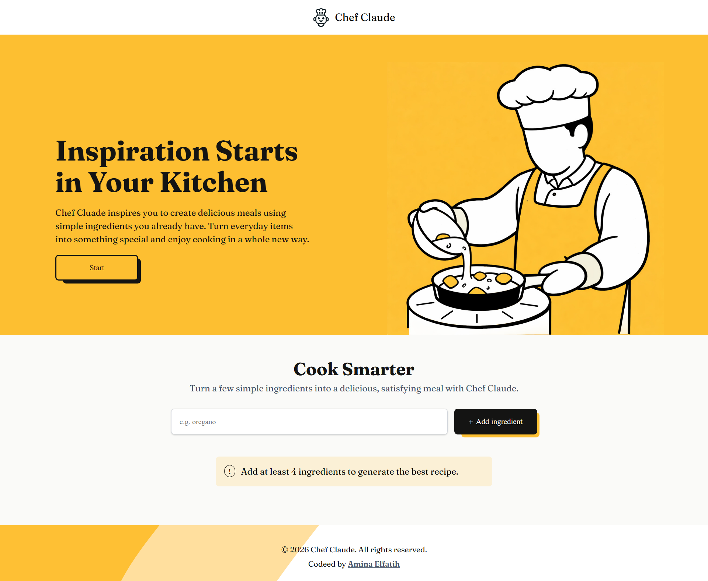
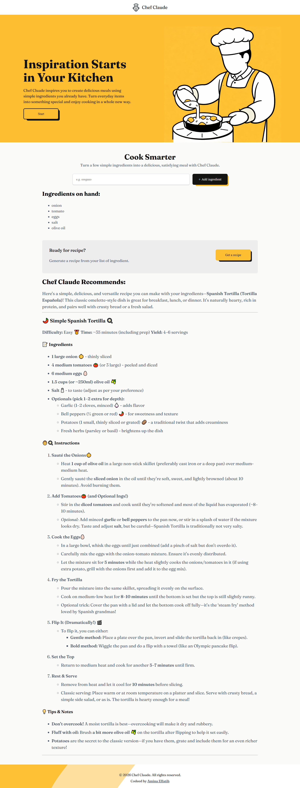

# Chef Claude AI 🍳

Chef Claude is an AI-powered cooking assistant that generates complete recipes based on the ingredients you provide.
Instead of searching the internet, just enter your available ingredients, and the AI generates a full recipe with preparation steps.

Originally built as a Scrimba course project, upgraded into a real product with improved UX and features.

## Live Demo 🚀

## Screenshots 📸

### Generated Recipe

### Loading State

### Home

## Features ✨
- Generate recipes from available ingredients
- Minimum ingredient validation (4 items)
- Loading component while recipe is generated
- Display formatted AI responses using Markdown
- Clean and responsive UI

## Tech Stack
### Frontend
- React
- CSS

### React Hooks
- useState, useEffect, useRef

### Libraries
- react-markdown for rendering AI-generated Markdown

### API
- Hugging Face Inference API

## How It Works 🧠
1- User enters ingredients
2- Input is validated (minimum 4 items)
3- Request sent to Hugging Face AI API
4- AI generates a recipe in Markdown
5- Recipe is displayed in the app

## Installation 📦
git clone https://github.com/minalfatih/Chef-Claude-AI
cd chef-claude-ai
npm install
npm run dev

## Project Purpose 🎯
This project demonstrates:
  - Working with APIs in React
  - Practical state management
  - Building real user experiences
  - Rendering AI Markdown responses